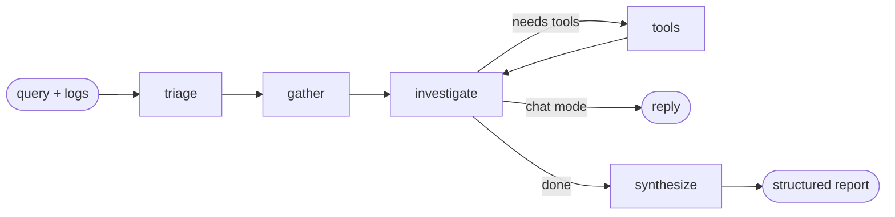

# Aegis

**AI incident response platform — retrieval-grounded root cause analysis for on-call engineers.**

Aegis reads the evidence you don't have time to read during an outage — thousands of log lines, the runbook nobody remembers writing, the postmortem from eight months ago — and returns a structured, cited hypothesis about what broke.

It is built around one conviction: **an incident response tool that can hallucinate is worse than no tool at all.** Every factual claim Aegis makes about your systems is traced to a retrieved document. When it doesn't know, it says so.

```
┌─────────────────────────────────────────────────────────────────┐
│  "Checkout is throwing 503s. Here are 4,000 lines of logs."     │
└─────────────────────────────────────────────────────────────────┘
                                │
     ┌──────────────────────────┴──────────────────────────┐
     │  triage → gather → investigate ⇄ tools → synthesize │
     └──────────────────────────┬──────────────────────────┘
                                │
┌─────────────────────────────────────────────────────────────────┐
│  H1 (0.65) Connection pool exhausted after the 10:20 deploy     │
│      Evidence: E1 (4,812 timeouts from 10:23), E3 (runbook §2)  │
│      Rule out by: check cl_waiting; if <10 this isn't it        │
│  H2 (0.20) Upstream gateway degradation                         │
│  Immediate: enable queued auth to stop customer impact          │
│  Open questions: no metrics available to confirm saturation     │
└─────────────────────────────────────────────────────────────────┘
```

---

## Contents

- [What it does](#what-it-does)
- [Quick start](#quick-start)
- [How it works](#how-it-works)
- [Using it](#using-it)
- [Configuration](#configuration)
- [Development](#development)
- [Documentation](#documentation)
- [Project status](#project-status)

---

## What it does

### Hybrid retrieval over your operational corpus

Two search strategies run in parallel and are fused by Reciprocal Rank Fusion:

- **Dense vector search** (pgvector, HNSW) captures *meaning* — it finds the connection-pool runbook when you describe the symptom in your own words.
- **Lexical full-text search** (Postgres `tsvector`, GIN) captures *exact tokens* — error codes, `NoBrokersAvailable`, a specific pod name. Embeddings reliably smooth these away.

During an incident your query contains both: prose describing the symptom, and pasted literals from a stack trace. Either strategy alone drops half of it. An optional LLM cross-encoder reranks the fused shortlist.

### Structure-aware chunking

Splitting a runbook every 500 characters produces chunks like *"2. If saturated, scale replicas"* with no indication of which failure that addresses — retrieved mid-incident, that reads as authoritative advice detached from its precondition.

Aegis splits on heading structure first, then packs sections into token budgets, and stamps every chunk with its full breadcrumb (`Payments > Troubleshooting > 503 errors`). The breadcrumb is embedded along with the body, so a chunk always knows what it's about.

### Log analysis that actually scales

A 10,000-line log bundle does not fit in a context window, and pasting the first 2,000 lines shows the model the least interesting part of the incident.

Aegis extracts *templates* — masking UUIDs, IPs, durations, and identifiers — so ten thousand lines collapse into a few dozen patterns with counts and onset times:

```
Connection to <ID> timed out after <DURATION>    ×4,812   first seen 10:23:04
```

That compresses by 1–3 orders of magnitude while *increasing* signal. It also detects error bursts, retry storms, clean-then-broken onset patterns, and errors correlated across multiple services.

Parses JSON lines, logfmt, and plain text. Keeps multi-line stack traces intact.

### Falsifiable, cited reports

The agent is forced into a structured schema rather than free text:

- **Ranked hypotheses**, each with a confidence score, supporting evidence IDs, and — critically — **disconfirming checks**: a cheap observation that would rule it out.
- **Evidence entries** that can explicitly *contradict* a hypothesis. Recording contradicting evidence is what separates analysis from confirmation bias.
- **Remediation steps** annotated with risk level and reversibility. Commands are quoted only from retrieved sources, never invented.
- **Immediate actions** kept separate from remediation, because stopping the bleeding and fixing the cause are different decisions on different timescales.
- **Open questions** — what it could not determine. An empty list on an uncertain investigation would be a false claim of completeness.

Validators repair what LLMs reliably get wrong: dangling evidence references are dropped, steps are renumbered, hypotheses re-ranked by confidence.

### Production infrastructure

Async throughout (FastAPI + asyncpg). JWT auth with typed tokens. RFC 9457 problem responses. Structured logging with request correlation. Prometheus metrics with bounded label cardinality. Alembic migrations. Multi-stage Docker build. 222 tests.

---

## Quick start

**Requirements:** Docker + Docker Compose, and an OpenAI API key.

```bash
# 1. Create your environment file
make env
#    Then edit .env.development and set:
#      OPENAI_API_KEY=sk-...
#      JWT_SECRET_KEY=$(make secret)

# 2. Start Postgres (with pgvector), the API, Prometheus, and Grafana
make up

# 3. Create an admin account (needed to write to the knowledge base)
make admin EMAIL=you@example.com

# 4. Index the bundled sample runbooks and postmortems
make ingest-samples

# 5. Confirm it worked
make stats
make search Q="checkout returning 503 with gateway timeouts"
```

| Service | URL |
|---|---|
| API docs | http://localhost:8000/docs |
| Health | http://localhost:8000/api/v1/health |
| Metrics | http://localhost:8000/metrics |
| Prometheus | http://localhost:9090 |
| Grafana | http://localhost:3000 |

### Without Docker

```bash
make install                 # creates .venv, installs everything
make env
# start your own PostgreSQL 16+ with the pgvector extension, then:
make migrate
make dev
```

### Try it without a database

Log analysis is pure computation — no database, no API key:

```bash
.venv/bin/python -m aegis.cli analyze /path/to/your.log
```

---

## How it works

### The workflow

A generic agent loop is *call model → run tools → repeat*. Incident response has structure worth encoding in the graph itself:



**triage** — Classifies intent and severity, and generates 2–4 *search query variants*. This matters more than it looks: the way a user describes a problem ("checkout is broken") frequently shares no vocabulary with the runbook that answers them ("payment gateway upstream timeout"). Searching only the raw query systematically under-retrieves.

**gather** — Retrieves knowledge base context, analyses supplied logs, and pulls prior resolved incidents — all concurrently. This is *unconditional*, not left to the model's discretion. An agent that has to decide to look things up frequently decides not to, and then answers from parametric memory.

**investigate** — The reasoning loop, now starting from evidence rather than from nothing. Can call tools to dig further, hard-bounded by `AGENT_MAX_TOOL_ITERATIONS`.

**synthesize** — Forces the accumulated reasoning into the report schema. Separated from investigation because the two need different things: investigation wants freedom to explore, synthesis wants rigid validated output.

Every node degrades rather than raises. A failed log analysis produces a report that says so — not a 500.

### The agent's tools

Ordered by preference. Models are biased toward tools listed earlier, so grounded internal knowledge comes first and public web search comes last.

| Tool | Purpose |
|---|---|
| `search_runbooks` | Runbooks, architecture notes, alert definitions |
| `search_postmortems` | Written postmortems — precedent beats inference |
| `find_similar_incidents` | Resolved incidents with human-confirmed root causes |
| `search_knowledge_base` | Unfiltered fallback |
| `analyze_log_excerpt` | Parse and summarise pasted logs |
| `extract_error_signatures` | Just the distinct error templates |
| `compute_incident_timeline` | Time-bucketed volume and error rate |
| `list_documented_services` | Coverage check |
| `web_search` | Third-party software only — never evidence about *your* system |

### Retrieval pipeline

```
query
  ├─ embed ──────────────► vector search (HNSW, cosine)  ─┐
  └─ (raw text) ─────────► lexical search (GIN, ts_rank_cd)┤
                                                          ▼
                                    Reciprocal Rank Fusion (rank-based,
                                    scale-free — no score calibration)
                                                          ▼
                                    LLM cross-encoder rerank (optional)
                                                          ▼
                                    threshold → top-k → cited context
```

Why RRF rather than a weighted score sum: cosine similarity and `ts_rank_cd` are not on a common scale, and normalising them is unstable — the same document scores differently depending on what it was retrieved alongside. RRF ignores scores entirely and fuses on rank. A document found by *both* arms outranks one found by either alone, even if it was never first anywhere. That agreement is the signal hybrid retrieval exists to exploit.

### Layout

```
aegis/
├── api/v1/          HTTP endpoints (auth, chat, incidents, knowledge, health)
├── core/
│   ├── config.py    validated settings; refuses unsafe production config
│   ├── langgraph/   the workflow graph and the agent's tools
│   ├── prompts/     system, triage, and synthesis prompts (markdown)
│   ├── logging.py   structured logging with request correlation
│   ├── metrics.py   Prometheus instrumentation
│   └── exceptions.py domain error hierarchy
├── ingestion/       loaders → chunking → pipeline
├── retrieval/       embeddings → vector store → hybrid fusion
├── analysis/        log parsing → template clustering → anomaly detection
├── models/          database tables
├── schemas/         API contracts and structured LLM output
└── services/        async database and LLM access
```

---

## Using it

### Run an investigation

```bash
# 1. Register and get a user token
TOKEN=$(curl -sX POST localhost:8000/api/v1/auth/login \
  -H 'Content-Type: application/json' \
  -d '{"email":"you@example.com","password":"your-passphrase"}' | jq -r .access_token)

# 2. Investigate
curl -sX POST localhost:8000/api/v1/incidents/investigate \
  -H "Authorization: Bearer $TOKEN" \
  -H 'Content-Type: application/json' \
  -d '{
        "query": "Checkout is returning 503s. Started around 10:23.",
        "service": "payments",
        "severity": "sev2",
        "logs": "2026-08-15 10:23:04 ERROR [payments] upstream connect timeout..."
      }' | jq .markdown -r
```

### Search directly

Sometimes you know what you're looking for and don't need a model to summarise it:

```bash
curl -sX POST localhost:8000/api/v1/knowledge/search \
  -H "Authorization: Bearer $TOKEN" \
  -H 'Content-Type: application/json' \
  -d '{"query":"connection pool exhausted","service":"platform","top_k":5}' | jq
```

### Ingest your own documentation

Aegis infers a document's service and type from front matter, directory layout, or filename:

```
data/
├── runbooks/payments/gateway-timeouts.md    → service=payments, type=runbook
└── postmortems/2026-07-checkout.md          → type=postmortem
```

```bash
make ingest PATH_ARG=/path/to/your/runbooks
```

Re-ingesting is idempotent — unchanged files are skipped by content hash before any embedding cost is incurred. A nightly sync over 1,000 runbooks where 3 changed costs 3 embeddings.

### Key endpoints

| Method | Path | Purpose |
|---|---|---|
| `POST` | `/api/v1/incidents/investigate` | Run a full investigation |
| `POST` | `/api/v1/knowledge/search` | Hybrid search |
| `POST` | `/api/v1/knowledge/analyze-logs` | Log analysis, no LLM |
| `POST` | `/api/v1/chat` | Conversational turn |
| `POST` | `/api/v1/chat/stream` | Streaming (SSE) |
| `POST` | `/api/v1/incidents` | Open an incident |
| `PATCH` | `/api/v1/incidents/{id}` | Record the true root cause |
| `GET` | `/api/v1/health/ready` | Readiness probe |

Full reference: **[docs/api.md](docs/api.md)**.

---

## Configuration

Every setting is validated at startup. Staging and production **refuse to boot** with a weak JWT secret, a wildcard CORS origin, `DEBUG=true`, or a placeholder database password — a misconfigured deployment fails immediately and loudly rather than at the first request that touches the bad value.

The knobs that matter most:

| Setting | Default | Effect |
|---|---|---|
| `DEFAULT_LLM_MODEL` | `gpt-4o-mini` | Primary reasoning model |
| `EMBEDDING_DIMENSIONS` | `1536` | **Must match the pgvector column.** Changing needs a migration + full re-ingest |
| `RETRIEVAL_TOP_K` | `8` | Chunks handed to the agent |
| `HYBRID_VECTOR_WEIGHT` | `0.7` | Lower toward `0.5` if your corpus is dense with exact error codes |
| `RERANK_ENABLED` | `true` | Better precision, one extra LLM call per search |
| `CHUNK_TARGET_TOKENS` | `512` | Chunk size; changing needs `--force` re-ingest |
| `AGENT_MAX_TOOL_ITERATIONS` | `6` | Hard cap before synthesis is forced |

See [`.env.example`](.env.example) for all of them, and **[docs/configuration.md](docs/configuration.md)** for the reasoning behind each default.

---

## Development

```bash
make install      # venv + all dependencies
make test         # 222 tests
make test-cov     # with coverage
make lint         # ruff check + format check
make verify       # everything CI runs
make check        # verify config and dependency reachability
```

Unit tests need no database or API key — retrieval fusion, chunking, log analysis, token handling, and schema validation are all pure functions and tested exhaustively.

```bash
make migration M="add widget table"   # autogenerate
make migrate                          # apply
make migrate-sql                      # print SQL without applying
```

---

## Documentation

| Document | Contents |
|---|---|
| **[docs/architecture.md](docs/architecture.md)** | System design, data flow, why each boundary is where it is |
| **[docs/rag-pipeline.md](docs/rag-pipeline.md)** | Chunking, embedding, hybrid retrieval, and rank fusion in depth |
| **[docs/agent.md](docs/agent.md)** | The workflow graph, prompts, tools, and report schema |
| **[docs/log-analysis.md](docs/log-analysis.md)** | Parsing, template extraction, anomaly heuristics |
| **[docs/api.md](docs/api.md)** | Full endpoint reference with examples |
| **[docs/configuration.md](docs/configuration.md)** | Every setting and the reasoning behind its default |
| **[docs/deployment.md](docs/deployment.md)** | Docker, Kubernetes, scaling, migrations |
| **[docs/operations.md](docs/operations.md)** | Metrics, alerts, troubleshooting, tuning retrieval quality |
| **[docs/security.md](docs/security.md)** | Threat model, auth design, known limitations |
| **[docs/development.md](docs/development.md)** | Setup, testing strategy, adding tools and document types |
| **[docs/adr/](docs/adr/)** | Architecture decision records |

---

## Project status

**What works:** everything described above. The full pipeline — ingestion, hybrid retrieval, log analysis, the agent workflow, structured reports, the HTTP API, metrics, and migrations — is implemented and tested.

**What is deliberately not built:**

- **No live telemetry integrations.** Aegis reasons over logs you give it and documents you index. It does not query Prometheus, Datadog, or CloudWatch directly. Adding a metrics tool is a natural next step — see [docs/development.md](docs/development.md#adding-a-tool).
- **No alerting or chat integrations.** No Slack bot, no PagerDuty webhook.
- **Rate limits are per-replica.** In-process, so N replicas permit roughly N× the configured rate. Point slowapi at Redis for strict global limits.
- **No token revocation.** Changing a password does not invalidate existing tokens; there is no denylist. See [docs/security.md](docs/security.md).
- **The eval harness grades traces, not ground truth.** It scores relevance, hallucination, and conciseness against Langfuse traces. The `root_cause` field on resolved incidents is captured and ready to grade against, but that scorer is not written yet.

### Credits

The FastAPI + LangGraph skeleton originated from [wassim249/fastapi-langgraph-agent-production-ready-template](https://github.com/wassim249/fastapi-langgraph-agent-production-ready-template). The retrieval, ingestion, analysis, agent workflow, and domain model are original to this project.

### License

MIT.
