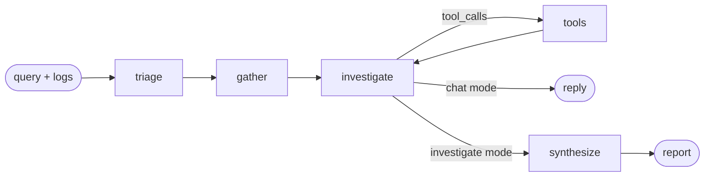

# The agent

The workflow graph, the prompts, the tools, and the report contract.

## Contents

- [Why a structured graph](#why-a-structured-graph)
- [The nodes](#the-nodes)
- [State](#state)
- [Tools](#tools)
- [Prompts](#prompts)
- [The report schema](#the-report-schema)
- [Bounds and failure handling](#bounds-and-failure-handling)

---

## Why a structured graph

The generic agent loop is:

```
model → tools → model → tools → ... → answer
```

That is a reasonable default and a poor fit for incident response, for one
specific reason: **the model decides whether to gather evidence.** In practice
it frequently decides not to — the question looks answerable from general
knowledge, so it answers from general knowledge, fluently and without
grounding.

Aegis moves evidence gathering out of the model's control:



By the time the model reasons at all, it has runbook passages, a log summary,
and prior incidents in front of it. It can still call tools to dig further — but
it cannot start from nothing.

---

## The nodes

Source: [`aegis/core/langgraph/graph.py`](../aegis/core/langgraph/graph.py)

### `triage`

Classifies intent, service, and severity — and generates **2–4 search query
variants**.

The query variants are the highest-value part of this node. The way a user
describes a problem rarely matches the vocabulary of the runbook that answers
them:

| User says | Runbook says |
|---|---|
| "checkout is broken" | "payment gateway upstream timeout" |
| "everything is slow" | "connection pool saturation" |
| "getting 503s" | "service unavailable during authorisation" |

The triage prompt asks for variants deliberately spanning the user's wording,
the technical terms a runbook author would use, any exact error string, and a
general description of the failure mode.

A service named by the user is authoritative; the model's inference is only a
fallback. A wrong service filter silently hides the correct runbook, which is
worse than no filter.

**On failure**: falls back to searching the raw query. Degraded retrieval beats
no investigation.

### `gather`

Runs three things concurrently:

1. **Retrieval** over every query variant, merged by best score per chunk.
2. **Prior incidents** — resolved, with a human-confirmed root cause.
3. **Long-term memory** — mem0 user facts, if enabled.

They are independent, and during an incident the difference between 1.2s and
3.5s of setup is worth the small added complexity.

### `investigate`

The reasoning turn. The system prompt is rebuilt each iteration so freshly
gathered evidence is always present, and is **excluded from history trimming** —
a trimmed-away system prompt turns a grounded incident responder into a generic
chatbot mid-conversation.

**On failure**: returns an `AIMessage` describing the failure rather than
raising, so synthesis still runs and the user gets the evidence that *was*
gathered.

### `tools`

Executes every requested tool concurrently. Tool failures become `ToolMessage`
content, never exceptions — the model reads what went wrong and adapts.

Citations from retrieval tools are folded into state here so they survive into
the final report.

### `synthesize`

Forces the accumulated reasoning into `InvestigationReportSchema`.

Separated from `investigate` because the two want opposite things: investigation
wants freedom to explore, synthesis wants rigid validated output. Trying to do
both in one prompt produces reports that are either under-structured or
under-reasoned.

Citations are attached **from state**, not from the model's output — trusting
the model to reproduce citation metadata accurately is exactly how a fabricated
source ends up rendered as a real one.

**On failure**: emits a minimal valid report saying synthesis failed, with the
evidence still available in the transcript.

### Routing

`_route_after_investigate` is three-way: run tools, stop (chat mode), or
synthesize.

The iteration cap is checked **before** honouring a tool request. Without that
ordering, a model that keeps calling tools would loop until the HTTP request
times out — producing no answer at all after burning the full budget. Instead it
is forced into synthesis and the investigation is recorded as `truncated`.

---

## State

Source: [`aegis/schemas/graph.py`](../aegis/schemas/graph.py)

Everything the agent learns lives in `GraphState`, because state is what gets
checkpointed. A field kept in a node-local variable disappears when the process
restarts mid-investigation, and resuming from the checkpoint would silently lose
the log analysis or retrieved context.

`messages` uses LangGraph's `add_messages` reducer (append, dedupe by id). Plain
fields are overwritten by whichever node wrote last.

The session id *is* the checkpoint `thread_id`, which is what gives a
conversation durable memory across processes.

---

## Tools

Source: [`aegis/core/langgraph/tools/`](../aegis/core/langgraph/tools/)

### Registry order is a prompt-engineering lever

Models are biased toward tools listed earlier when several look applicable. The
registry is ordered by how much we want each one reached for:

| # | Tool | Notes |
|---|---|---|
| 1 | `search_runbooks` | Runbooks, architecture, alert definitions |
| 2 | `search_postmortems` | Precedent — a confirmed cause beats a plausible one |
| 3 | `find_similar_incidents` | Human-recorded ground truth |
| 4 | `search_knowledge_base` | Unfiltered fallback |
| 5 | `analyze_log_excerpt` | Templates, counts, time range, anomalies |
| 6 | `extract_error_signatures` | Just the distinct error templates |
| 7 | `compute_incident_timeline` | ASCII histogram of volume and errors |
| 8 | `list_documented_services` | Coverage check |
| 9 | `web_search` | Third-party software only |

Count also matters: beyond roughly a dozen tools, selection accuracy degrades
noticeably. The set is deliberately small and non-overlapping.

### The three rules every tool follows

**1. Never raise.** A tool exception aborts the graph. Failures return as text
the model can read.

**2. Return text, not objects.** The result becomes a `ToolMessage` in the
conversation, so it must be self-describing prose.

**3. Say when nothing was found, explicitly.** This is the subtle one. An empty
result rendered as an empty string invites the model to fill the silence with
invention. So the tools say so, and say what to do about it:

> *"No runbook passages matched 'X'. The knowledge base may not cover this
> failure mode. Do not invent a runbook; say plainly that no documented
> procedure was found and reason from first principles instead."*

### Docstrings are the interface

The model chooses tools by reading their docstrings, so they carry the usage
policy. `web_search` is the clearest example:

> *"Use this ONLY after the knowledge base has been searched and came back
> without an answer... Public results know nothing about this organisation's
> architecture. Never treat a web result as evidence about what this system is
> doing."*

---

## Prompts

Source: [`aegis/core/prompts/`](../aegis/core/prompts/)

Prompts live in markdown files, not Python string literals. Prompt changes are
the most frequent change in an LLM system and should not require a code review
of escaping.

### Placeholders are `{{name}}`, not `{name}`

The previous implementation called `str.format()` on the prompt body, which
breaks the moment a prompt contains a JSON example — and every prompt
specifying structured output contains one. `str.format` reads
`{"summary": ...}` as a format field named `"summary"` and raises `KeyError`.

Double-brace substitution has no such collision, so prompts can show the exact
JSON they expect back.

Unsupplied placeholders render as empty strings rather than raising: an optional
context block (log analysis when no logs were provided) should be absent, not
fatal.

### The three prompts

| File | Purpose |
|---|---|
| [`system.md`](../aegis/core/prompts/system.md) | Behaviour, grounding rules, reasoning discipline |
| [`triage.md`](../aegis/core/prompts/triage.md) | Classification and query generation |
| [`synthesis.md`](../aegis/core/prompts/synthesis.md) | The report contract |

### The system prompt's six rules

1. Ground every factual claim about this system in retrieved evidence.
2. Never invent a command, runbook, or configuration value.
3. Distinguish observation from inference, always.
4. Say what you do not know.
5. Calibrate confidence.
6. Prefer mitigation over diagnosis when impact is active.

Plus explicit reasoning discipline that counteracts known LLM failure modes:
correlation is not causation; the loudest signal is often a downstream symptom;
absence of errors is information; check boring explanations first (deploys,
certs, disk, quota, DNS); do not anchor on the reporter's theory.

The current timestamp is injected on every render. Models have no clock —
without it they compute relative times against their training cutoff and produce
confidently wrong incident timelines.

---

## The report schema

Source: [`aegis/schemas/incident.py`](../aegis/schemas/incident.py)

This is the most important contract in the system. Free text from an LLM is
impossible to evaluate, render consistently, or act on programmatically.

### What the structure buys

**Falsifiability.** Every hypothesis carries an explicit confidence and evidence
IDs. *"The connection pool is exhausted (0.8, from E1 and E3)"* can be checked;
*"it might be the database"* cannot.

**Auditability.** `citations` link claims to specific chunks, so a reader can
verify the agent is quoting a real runbook rather than recalling a plausible
one.

**Safety.** Steps carry `risk` and `reversible`. During a SEV1 the difference
between "restart the pod" and "failover the primary" must be visible *before*
someone runs it.

**Evaluation.** Structured fields can be scored against the human-recorded root
cause once the incident is resolved.

### Fields that exist for a specific reason

| Field | Why |
|---|---|
| `disconfirming_checks` | Forces testable claims. Asking "what would rule this out?" pushes the model away from unfalsifiable narratives. |
| `evidence[].supports: false` | Contradicting evidence is modelled explicitly. Recording it is what separates analysis from confirmation bias. |
| `immediate_actions` | Separate from remediation. Stopping the bleeding and fixing the cause are different decisions on different timescales. |
| `open_questions` | What it could not determine. An empty list on an uncertain investigation is a false claim of completeness. |
| `command: null` | Populated only when a retrieved source contains that exact command. An invented command gets pasted into a production shell. |

### Validators repair what models get wrong

Reliably, and in the same ways:

| Validator | Fixes |
|---|---|
| `_sync_confidence_with_leading_hypothesis` | Top-level confidence left at 0 alongside a 0.9 hypothesis |
| `_drop_dangling_evidence_references` | A hypothesis citing `E7` when no `E7` exists — a hallucinated citation |
| `_renumber_remediation_steps` | Duplicate or skipped ordinals, which would render an out-of-order checklist |
| `_rank_hypotheses` | Hypotheses not ordered by confidence |

Dangling references are **dropped, not rejected** — partial output during an
incident beats none.

### `needs_human_review`

Three independent triggers: no hypothesis at all, confidence below 0.5, or any
`high` risk step. Surfaced on the API response so a caller can route to a human
rather than automate.

---

## Bounds and failure handling

| Bound | Setting | Behaviour at the limit |
|---|---|---|
| Tool iterations | `AGENT_MAX_TOOL_ITERATIONS` (6) | Forced into synthesis; recorded `truncated` |
| Graph recursion | derived: `cap × 3 + 10` | LangGraph raises; caught as `AgentError` |
| Log lines parsed | `AGENT_MAX_LOG_LINES` (5000) | Truncated, and the summary says so |
| Output tokens | `LLM_MAX_OUTPUT_TOKENS` (4000) | Provider truncates |

Watch `aegis_agent_investigations_total{outcome="truncated"}`. A sustained rate
above ~25% means either the cap is too low or retrieval quality is poor enough
that the agent keeps searching for something it never finds.

### Every node degrades

| Node fails | Result |
|---|---|
| `triage` | Search the raw query |
| `gather` retrieval | Empty context, and the prompt says so explicitly |
| `investigate` | A message describing the failure; synthesis still runs |
| A tool | Error text fed back; the model adapts |
| `synthesize` | Minimal valid report; evidence preserved in the transcript |

The only hard failure is the graph itself raising, which becomes `AgentError`
and a 500.

### Long-term memory is optional

mem0 personalisation is best-effort. Memory writes are fire-and-forget with a
strong task reference held (without it, asyncio may garbage-collect a running
task mid-execution and cancel it silently). Failures are logged and ignored —
losing personalisation must never block an investigation.
